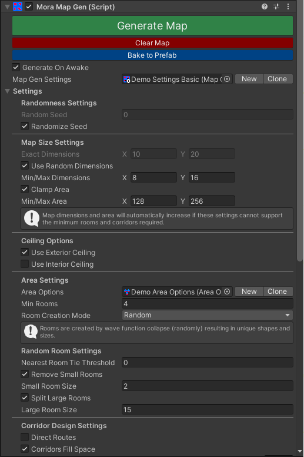

# Complete Setup
#### 1. Add the MoraMapGen component to scene

This is what generates the map at runtime.

Create a new GameObject in your scene and add the "MoraMapGen" component.

#### 2. Create a new MapGenSettings asset

The MapGenSettings allows you to customize how the map is generated and what it looks like.

Create and assign a new MapGenSettings asset in the MoraMapGen inspector by either:
- Click the "New" button in the MoraMapGen inspector.
- Right-click in your project assets folder and select "Create/MoraMapGen/Map Gen Settings Asset", then assign the new asset in the MoraMapGen inspector.

#### 3. Choose your desired settings

For detailed explanations of each setting and option see the Settings section below.

Note: The MoraMapGen inspector allows you to change the settings without having to select the asset directly, but you can change the settings in either place.

#### 4. Create a new Area Options asset

The Area Options asset determines which Area Definitions will be assigned to the rooms and corridors of the generated map.

Create and assign a new Area Options asset in the MapGenSettings "Area Options" field by either:
- Click the "New" button next to the "Area Options" field.
- Right-click in your project assets and select "Create/MoraMapGen/Area Options", then assign the new asset to the "Area Options" field in the settings.

#### 5. Create Area Definition Assets

An Area Definition specifies which module prefabs are used to construct the walls, floors, and ceiling of the given room or corridor.

Set up your RoomOptions asset by creating and assigning various Room Definition assets.
To create a new Room Definition asset, right-click in your project assets and select "Create/MoraMapGen/Area Definition"

At a minimum you must define the Default Room and Default Corridor in the Room Options asset inspector:

Note: The name of the Area Definition asset can be anything you'd like, but we suggest using something meaningful, especially for specific rooms. Consider that this name might be displayed in your game's UI to show players what room they are in.

#### 6. Create Tile Module Definitions
A Tile Module Definitions asset specifies which module prefabs are used when creating the 3D room or corridor for an Area Definition.

At a minimum, you just need one Tile Module Definitions asset, and all of your Area Definition assets can use this same Tile Module Definitions asset. This means that all rooms and corridors will have the same walls, floors, ceilings, and doors.

If you want specific rooms and/or corridors to have different looks, you'll need to give them different Tile Module Definitions. You could start by having one for all rooms and one for all corridors.

In the inspector for each of your Area Definition assets, you must assign a Tile Module Definitions asset.

To create a new Tile Module Definitions asset, right-click in your project assets and select "Create/MoraMapGen/Tile Module Definitions".

#### 7. Create Module prefabs
A module prefab is a GameObject prefab that has the 3D mesh you'd like to use to represent walls, floors, and ceilings.

Your module prefabs need nothing more than the typical Mesh Filter, Mesh Renderer, and ideally some sort of Collider depending on your needs. Here's the inside corner wall from the demo assets, for example:

Important Requirements:
- The dimensions (in Unity units) of your modules should be consistent, and are specified in the Tile Module Edge Size field in your Area Options asset. Ie, if you build your meshes with a module size of 3x3, then you must specify "3" in your Area Options asset.
- Prefab origins must all be in the same relative position. The meshes don't necessarily have to be the same size, but the origin should be in the middle of whatever module size you've defined. (Modules can have any Y height you want.)

You'll need prefabs for the following:
1. Straight walls: Used for straight wall segments.

2. Corner walls (inside): Convex corners, like you'd peek around when rounding a corridor corner.

3. Corner walls (outside): Concave corners, like the corner of a room.

4. Floors: Floor A is the main floor for rooms, and the edges of corridors. Floor B is the main path for corridors, and then entrance for rooms.

5. Exterior Ceilings: Visible from above (for top-down or third-person cameras.)

6. Interior Ceilings: Visible from inside (for first-person cameras.)

7. Doors: Placed where corridors connect to rooms. See [Door Placement Settings](xref:door-placement-settings) for different door modes.