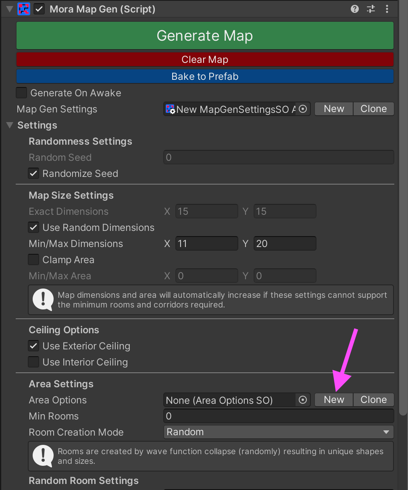

# Quick-Start Setup
#### 1. Add the MoraMapGen component to an empty GameObject in your scene

#### 2. Click "New" to create a new MapGenSettings asset

#### 3. Click the Area Options picker

#### 4. Select an existing Area Options asset

#### 5. Click the "Generate Map" button

Alternatively you can turn on "Generate On Awake" and then press Play to generate at runtime:
